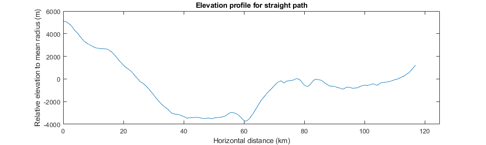
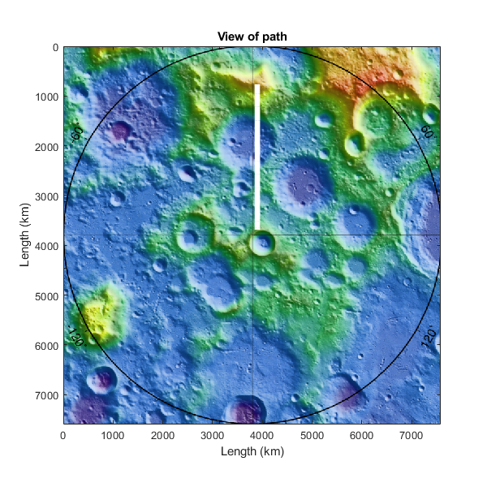
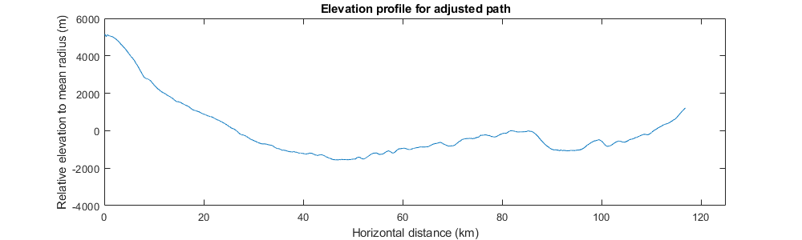
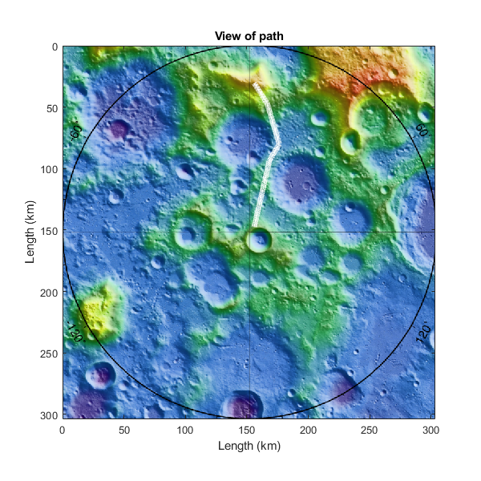

# Elevation Mapping

This short script generates elevation profiles for a chosen series of points.

## Usage

Go in the script and define your points as lat/lon pairs on the lunar surface. 

Sorry this isnt very clean yet.

## Known problems

Distance calculation for non-vertical/horizontal paths is actually incorrect, and needs to be fixed.

## Example output

